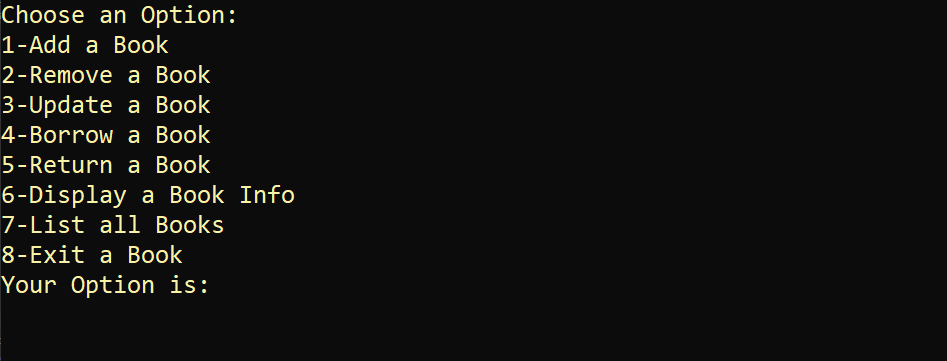

# 📚 Route Library System

### C++ Fundamentals — Mid-Course Project

A **console-based Library Management System built with C++**, created as a practical Mid-Course Project to apply core programming fundamentals in one complete system.

The project focuses on building a real-world-style application **without Object-Oriented Programming or File Handling**, keeping the implementation centered on the programming concepts covered at the fundamentals level.

---

## 🚀 Try the Live Demo

[**🌐 Open Live Demo**](https://mostafamadian.github.io/Route_Library_System_Mid_Project/)

[**💻 View C++ Source Code**](./C%2B%2B-Source/)

> The Live Demo is a browser-based simulation of the original C++ console application.  
> It follows the same general workflow and is provided for demonstration purposes.

---

## 🖥️ What Does the System Do?

The application manages a small library and allows the user to perform different operations on books.

### 📖 Book Management

- Add a new book
- Remove a book
- Update book information
  - Title
  - Author
  - Price
- Search for a book using its ID
- Display complete book information
- List all books

### 🔄 Library Operations

- Borrow a book
- Return a book
- Track book availability
- Generate book IDs automatically

### 💾 Dynamic Capacity

When the library reaches its current capacity, the system dynamically increases the available storage.

```text
Current Capacity → Full
        ↓
Expand Storage
        ↓
New Capacity = Current Capacity × 2
```

This gives students practical experience with **dynamic memory allocation and array resizing**.

---

## 🧠 C++ Concepts Practiced

This project brings together several fundamental C++ topics:

| Concept | Application in the Project |
|---|---|
| Variables & Data Types | Book information and program state |
| `if / else` | Validation and decision making |
| `switch` | Main menu operations |
| Loops | Processing and displaying books |
| Functions | Separating operations into reusable blocks |
| Strings | Book titles and authors |
| Arrays | Storing book information |
| Pointers | Managing dynamic arrays |
| References | Passing data efficiently |
| `new` / `delete[]` | Dynamic memory allocation |
| Function Templates | Reusable generic operations |
| `getline()` | Reading text input |
| Validation | Handling invalid user input |

---

## 🏗️ How the Data Is Organized

The project uses **parallel dynamic arrays**.

Each index represents one book across all arrays:

```cpp
int* bookId;
string* bookTitle;
string* bookAuthor;
double* bookPrice;
bool* isAvailable;
```

For example:

```text
Index       0              1              2
          ─────          ─────          ─────
ID           1              2              3
Title      Book A         Book B         Book C
Author     Author A       Author B       Author C
Price       20             35             15
Available   Yes            No             Yes
```

This approach allows the project to practice dynamic arrays and pointers **without introducing classes or objects yet**.

---

## 🔄 Main Program Flow

The user first specifies the library capacity and then interacts with the main menu.

```text
Start
  │
  ▼
Enter Library Capacity
  │
  ▼
Main Menu
  │
  ├── Add Book
  ├── Remove Book
  ├── Update Book
  ├── Borrow Book
  ├── Return Book
  ├── Display Book
  ├── List All Books
  │
  ▼
Continue / Exit
```

---

## 📋 Main Menu

The application is organized around a simple console menu:

```text
==========================================
          ROUTE LIBRARY SYSTEM
==========================================

1. Add Book
2. Remove Book
3. Update Book
4. Borrow Book
5. Return Book
6. Display Book Info
7. List All Books
8. Exit
```

The browser demo follows the same console-style idea so visitors can experience the project without installing Visual Studio.

---

## 🖥️ Application Screenshots

Screenshots of the original C++ console application will be displayed here.

### Library Introduction


### Main Menu



### Book Operations


### Book Information


---

## 📂 Project Structure

```text
Route_Library_System_Mid_Project
│
├── C++-Source
│   ├── Route_Library_System_Mid_Project.sln
│   │
│   └── Route_Library_System_Mid_Project
│       ├── Route_Library_System_Mid_Project.cpp
│       ├── Route_Library_System_Mid_Project.vcxproj
│       └── Route_Library_System_Mid_Project.vcxproj.filters
│
├── screenshots
│
├── index.html
│
└── README.md
```

### Why is there only one `.cpp` file?

This is intentional.

The project is designed as a **fundamentals-level Mid Project**, so the implementation is kept in a single source file rather than being divided into multiple classes and source files.

---

## 🌐 Live Demo vs. Original C++ Project

| Original C++ Project | Browser Live Demo |
|---|---|
| C++ console application | Browser-based simulation |
| Visual Studio | GitHub Pages |
| Dynamic arrays | JavaScript simulation |
| Pointers and `new` / `delete[]` | Simulated in browser |
| Original course implementation | Demonstration version |

The Live Demo is **not a web-development project**. It exists so visitors can interact with the project's main workflow directly from GitHub.

---

## 🚫 What This Project Does NOT Use

To keep the project aligned with the fundamentals level, it does **not** use:

- ❌ Object-Oriented Programming
- ❌ Classes
- ❌ File Handling
- ❌ Databases
- ❌ External libraries
- ❌ Web frameworks

These topics can be introduced in later projects as the course progresses.

---

## ▶️ How to Run the C++ Project

### Requirements

- Windows
- Visual Studio with C++ development tools

### Steps

1. Open `Route_Library_System_Mid_Project.sln`.
2. Build the solution.
3. Run the application.
4. Enter the library capacity.
5. Select an operation from the main menu.
6. Follow the instructions displayed in the console.

---

## 🎯 Project Objective

The goal of this project is to move from solving **individual programming exercises** to building a complete small-scale application.

Students practice how to:

- Break a problem into functions
- Manage collections of data
- Work with dynamic memory
- Validate user input
- Build menu-driven applications
- Connect multiple programming concepts together
- Think about how data is organized in memory

---

## 🎓 Educational Purpose

This project was created as part of a **C++ programming course** as a practical assessment of programming fundamentals.

It is intended to demonstrate how basic C++ concepts can be combined to create a functional application before moving to more advanced topics such as **OOP, File Handling, Data Structures, and Databases**.

---

## 🛠️ Technologies

- **C++**
- **Visual Studio**
- **GitHub**
- **GitHub Pages**
- **HTML / CSS / JavaScript** — Live Demo only

---

## 📌 Important Note

The Live Demo uses browser `localStorage` for demonstration data.

It is completely separate from the original C++ application and does not represent a real library database or production system.

---

## 📄 License

This project is provided for **educational purposes**.
